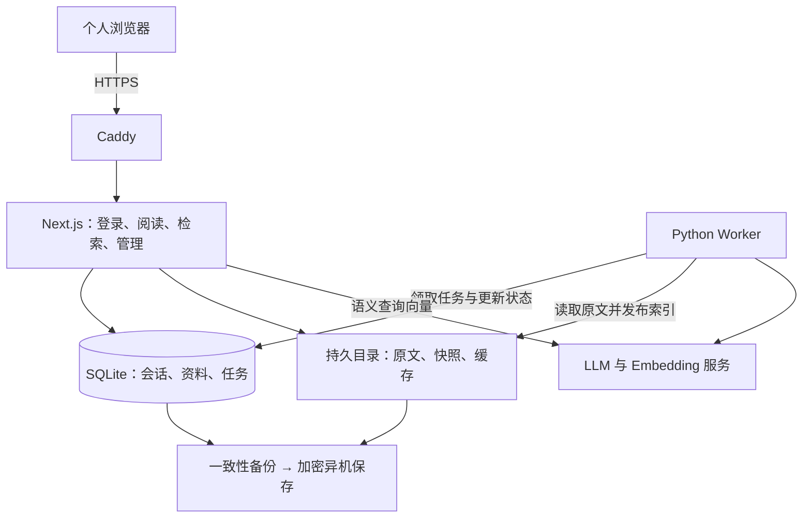

# 面经札记：下一阶段优化与服务器上线需求

> 范围调整：用户后续明确要求先完成“公开只读＋单管理员后台”的 Docker Desktop 最小改造。本文的全站私有、独立 Worker、SQLite、VPS／HTTPS 和 CI 等内容保留为历史规划，不再作为当前交付要求；以 [当前 README](../README.md) 和 [Docker 运行指南](docker.md) 为准。

- 文档日期：2026-09-26
- 基线版本：`a3f713a`（热门技术栈排行溢出修复已完成）
- 状态：待实施的需求与验收计划，不代表下述功能或部署文件已经完成。
- 已确认使用方式：**个人登录后使用的私有站点**，仅站点所有者访问和管理资料，不开放注册。

## 1. 目标与范围

下一阶段先完成“可以放心长期使用的私有服务器版本”，再提升整理和复习效率。上线后，用户应能通过自己的 HTTPS 域名登录，保存面经后离开页面，稍后查看整理结果；应用升级、处理失败和服务器重启均不应丢失已保存的原文。

保留现有产品方向：围绕 AI 开发岗位，以 RAG、Agent、MCP、模型推理等技术栈组织内容，不恢复前端／后端／算法岗位分类。每篇面经最多点亮一颗爱心，可取消；“热门”仍表示个人爱心优先，同分按时间降序，不包装成全站点赞量或行业热度。

本期不包含公开社区、多人注册、自动爬虫、训练模型、自建 GPU 推理和对话式问答。公开分享和多用户属于后续独立需求，不能通过放开访问限制直接启用。

### 成功标准

1. 未登录者无法读取任何面经原文、总结、搜索结果或管理数据。
2. 保存原文与 AI 整理解耦，失败能重试、进度可见，单篇失败不阻塞其他资料。
3. 完成一次真实模型的端到端验证和检索评测，明确成本与效果。
4. 在一台全新 Linux 服务器上按文档完成部署，并通过备份恢复与版本回退演练。
5. 上线后，能定位处理失败、模型不可用、磁盘不足和备份中断等问题。

## 2. 当前能力与主要缺口

| 领域 | 当前已实现 | 下一阶段缺口 |
| --- | --- | --- |
| 技术栈 | Next.js 16、React 19、TypeScript、Tailwind 4；Python 3.12+；uv 与 pnpm 锁文件 | Linux 生产镜像、版本升级检查、部署流水线 |
| 内容录入 | 粘贴原文、保留文件、自动分析与向量化、删除网页新增资料 | 编辑、文件上传、未发布草稿管理 |
| 分析 | 总结、技术标签、题目及原文证据；独立 LLM/Embedding 配置 | 真实服务兼容性、成本与效果验收 |
| 检索 | 关键词、语义、公司／标签筛选、命中片段 | 相关度排序、混合检索、稳定的真实评测集 |
| 阅读体验 | 详情页、时间升降序、爱心优先排序、技术栈排行 | 跨设备爱心、移动端细节与无障碍检查 |
| 写入安全 | 管理页及写入接口限制本机和同源 | 登录鉴权；外网域名的可信来源配置；读取接口保护 |
| 处理流程 | HTTP 请求启动 Python 构建；成功后原子替换快照 | 持久任务、重启恢复、单篇失败隔离 |
| 数据 | 原文、缓存、快照保存在本机；内容／模型配置用于缓存识别 | 独立数据目录、迁移、自动备份、恢复演练 |

具体改造入口为 `src/lib/management.ts`、`src/app/manage/page.tsx`、`src/app/api/`、`src/lib/data.ts`、`pipeline/` 与 `scripts/`。当前所有资料成功才发布新快照；失败时虽保留原文和旧快照，但未发布资料缺少完整的管理入口。

当前站点没有登录保护，管理页还只接受本机访问。**不能将现有服务直接映射到公网，也不能靠代理伪造 localhost 或简单删除校验完成上线。** 仓库目前没有生产 Docker／Compose 配置；文档后面的部署步骤以完成 P0 改造为前提。

## 3. 需求优先级与验收

优先级定义：P0 为开放公网访问前必须完成；P1 为上线后第一轮体验优化；P2 为有实际需求后再做。每项需求以验收结果关闭，不以“代码已提交”代替验收。

### 3.1 P0：私有站点上线必需项

| 编号 | 需求 | 验收标准 |
| --- | --- | --- |
| P0-01 | 单一管理员登录 | 使用维护中的认证组件实现账号密码登录和服务端会话；关闭注册。管理员通过服务器初始化命令创建，密码不明文保存；提供服务器端重置入口。登录、退出、过期、重置后旧会话失效均可验证。 |
| P0-02 | 全站权限与来源校验 | 首页、详情、搜索、任务状态、管理、导出及原文访问统一鉴权；页面跳转登录，API 返回 401。鉴权在实际读取／写入边界执行。生产域名由 `APP_ORIGIN` 明确配置，跨站写入返回 403；未知 Host 被拒绝。 |
| P0-03 | 异步整理与持久任务 | 原文可靠保存并登记任务后返回 202 和任务 ID；页面关闭不影响处理。显示排队、分析、向量化、发布、成功／失败状态及可理解的失败原因。重启后任务可恢复，不依赖浏览器或单次 HTTP 请求存活。 |
| P0-04 | 失败隔离、重试与删除一致性 | 一篇失败不阻止其他成功资料发布；失败草稿可查看原文、单独重试或删除。重复提交同一请求不重复创建；重复运行同一任务不重复发布。处理中删除资料后，旧任务不得把它重新发布。 |
| P0-05 | 数据目录与迁移 | 所有可变数据从统一 `DATA_DIR` 读取，放在持久卷中；应用升级不覆盖数据。首次空库可正常进入引导页。迁移保留相对来源路径和原 ID，校验数量、文件哈希、模型配置与索引版本；默认不向正式库导入虚构示例。 |
| P0-06 | 模型保护与真实验证 | 配置请求超时、有限重试、输入上限、语义搜索限流及调用预算；错误不得泄露密钥或完整原文。选定真实 LLM/Embedding 后完成录入→分析→检索→删除验证，提交效果与用量报告。 |
| P0-07 | 可重复部署 | 提供 Web 与 Worker 镜像、Compose、HTTPS 代理配置、生产环境变量模板、迁移命令。干净环境使用锁文件完成构建；服务器重启后服务自动恢复，公网不能直接访问应用端口或数据库。 |
| P0-08 | 备份、恢复与回退 | 原文、数据库、配置及索引形成一致备份，至少一份加密备份位于服务器之外。完成新目录恢复与一次版本回退演练，记录实际恢复时间和校验结果。 |
| P0-09 | 健康检查、日志与告警 | 能区分 Web 存活、数据可读、Worker 离线和模型故障；日志携带请求／任务 ID，不记录密钥和完整原文。备份过期、磁盘不足、连续任务失败可通知站点所有者。 |

#### 登录和访问控制细则

- 首版采用单管理员账号密码登录；具体认证库在 M0 选型评审中确认，要求支持当前 Next.js、服务端会话、关闭注册和会话撤销，不自行设计加密协议。
- 会话 Cookie 使用 `Secure`、`HttpOnly` 和适当的 `SameSite`；写操作同时校验 CSRF 令牌与来源。不能只靠隐藏页面、CORS 或 `SameSite` 保护接口。参照 [OWASP 会话管理指南](https://cheatsheetseries.owasp.org/cheatsheets/Session_Management_Cheat_Sheet.html)与 [CSRF 防护指南](https://cheatsheetseries.owasp.org/cheatsheets/Cross-Site_Request_Forgery_Prevention_Cheat_Sheet.html)。
- 私有 HTML、API 和原文不进入公共 CDN 缓存；退出后再次请求数据必须被拒绝。登录页不显示资料数量、标题、搜索摘要等私有信息。
- 登录限流建议初值为同一 IP 15 分钟最多 5 次失败，语义搜索同一账户每分钟 20 次；需可配置。可信代理范围固定，不能直接信任任意客户端传来的转发 IP。
- 本地开发仍保留方便的启动方式；生产缺少认证配置、域名或必要密钥时应拒绝以不安全模式启动。正式环境不得静默回退到演示模型。

#### 任务和数据一致性细则

- 任务状态持久化：`queued → running → succeeded / failed / canceled`，另存当前处理阶段、尝试次数、错误代码、租约到期时间和心跳。
- 首版只运行一个 Worker；通过事务领取任务和租约恢复异常中断任务。短暂超时／限流可指数退避，自动重试上限建议 3 次；凭据错误、非法输入等需修正后手动重试。
- 原文文件写入与数据库入队之间存在跨存储边界，必须采用暂存文件、事务记录及启动对账机制。只有原文与任务均可恢复时才向用户确认接收成功；幂等键处理响应丢失后的重发。
- 每篇资料记录内容版本、已发布版本和删除标记。Worker 发布前核对版本与删除状态；失败保留最后一次成功版本，并明确显示“新版本整理失败”。
- 快照发布必须串行、原子且可恢复。数据库记录当前发布版本；崩溃后可根据版本清单修复或重新生成快照，避免数据库和文件相互矛盾。
- 更换 Embedding 模型／维度／前缀时，在独立位置完整生成新索引并统一切换；切换前保留旧索引与旧查询模型配置，不得混用不同模型的向量。
- 模型调用成功但写缓存前崩溃，可能再次产生调用费用。记录这种风险，不承诺外部模型调用“恰好一次”；通过缓存、任务幂等和预算限制减少重复。

### 3.2 P1：上线后优先优化

| 编号 | 需求 | 验收标准 |
| --- | --- | --- |
| P1-01 | 爱心跨设备同步 | 爱心保存到服务器，按账户＋面经 ID 唯一；设置为已喜欢／未喜欢的请求可幂等重试。两台设备刷新后状态一致，仍为每篇 0／1 颗爱心；保留三种现有排序。 |
| P1-02 | 原文编辑与版本记录 | 编辑时先保存新版本，再异步整理；可查看旧原文并恢复为新版本。编辑冲突提示，不静默覆盖；失败时旧发布内容仍可阅读。 |
| P1-03 | 文件导入和重复提示 | 支持 UTF-8 `.md`／`.txt`，建议首版每批最多 20 个、单篇沿用现有字符上限，并定义总字节上限。逐篇显示成功／失败；路径与扩展名校验，重复内容提示跳过或另存，不自动删除旧资料。 |
| P1-04 | 检索相关度与混合检索 | 搜索新增“相关度”排序并默认使用，浏览模式保留时间／爱心排序。关键词与语义结果通过可解释的排序融合去重，展示命中原文；用同一评测集与现有基线比较，不以相似度冒充准确率。 |
| P1-05 | AI 技术栈治理 | 规范标签别名与大小写，保持 AI 开发技术优先；篇数按面经去重。区分“AI 技术优先”与“按收录篇数”，避免把编辑置顶描述为外部行业热度。 |
| P1-06 | 阅读与移动端体验 | 320／375／768／1440 像素宽度无水平溢出；长标签、代码块、空列表、失败提示均可用。搜索筛选可恢复，键盘可操作，爱心按钮有可访问名称及状态，删除后焦点与反馈明确。 |

爱心迁移需特别处理：当前记录属于本机浏览器的 `localStorage`。新 HTTPS 域名不能自动读取旧 localhost 的记录。上线迁移工具应允许在旧站导出 ID 清单并保留文件；P1-01 提供登录后导入、去重及失效 ID 提示。在 P1 完成前，新站爱心仍只保存在当前浏览器，须明确说明这一限制。

### 3.3 P2：按使用反馈决定

| 候选需求 | 启动条件 |
| --- | --- |
| 面试题复习清单、掌握程度、复习提醒 | 用户已持续使用资料库，并明确需要复习工作流 |
| PDF／图片 OCR 导入 | 文本导入稳定且存在足够多的此类资料；另行设计解析成本和质量验收 |
| 带有效期的只读分享 | 明确需要向他人分享特定资料；单独设计授权、撤销与隐私范围 |
| 多用户与公开社区 | 产品范围正式改变后再设计数据隔离、用户管理和公开热度 |
| PostgreSQL／专用向量索引 | 实测片段规模、内存或并发超出本方案；需要多机部署时重新评估 |

## 4. 推荐技术方案

推荐首版使用 **一台 Linux 云服务器 + Docker Compose + Caddy + Next.js Web + Python Worker + SQLite + 持久文件目录**。沿用现有两种语言及处理管线，增加可靠运行所需的最小基础设施。

| 层次 | 选择 | 原因与边界 |
| --- | --- | --- |
| 页面与 API | 保留 Next.js、React、TypeScript、Tailwind | 复用现有界面和接口；上线前更新到所选版本线的安全补丁并回归 |
| AI 处理 | Python 独立常驻 Worker，uv 锁定依赖 | 长耗时工作离开 HTTP 生命周期；复用分析、切分和缓存 |
| 状态存储 | SQLite 保存账户／会话、资料元数据、版本、任务和后续爱心 | 适合首版单机个人服务；通过有版本的迁移管理表结构 |
| 原文与检索 | 原文文件 + 版本化快照／向量文件 | 优先复用现有能力；数据库管理状态，文件保存内容和可重建索引 |
| 模型 | 云端 LLM 与 Embedding，独立配置 | 无需 GPU；根据实测中文效果、延迟、费用和数据处理条件确定服务商 |
| 入口 | Caddy 终止 HTTPS 并反向代理 | 集中处理域名、证书和请求入口 |
| 交付 | Docker Compose、CI 验证及版本化镜像 | 固定环境，保留可回退版本；生产不使用开发服务器 |

Next.js 官方建议自托管时在应用之前放置反向代理。本项目包含动态 API 和读写流程，应以 Node 服务运行，不能使用纯静态导出替代。参见 [Next.js 自托管指南](https://nextjs.org/docs/app/guides/self-hosting)。

SQLite 文件必须位于同一宿主机的本地持久磁盘，配置短事务、写锁等待和受控迁移；Web 与 Worker 使用同一数据契约。WAL 模式不适用于多主机共享网络文件系统，不能通过把数据库挂到网络盘实现多机扩容。参见 [SQLite WAL 说明](https://www.sqlite.org/wal.html)。

### 4.1 数据与接口设计交付要求

建议的核心实体为 `users`、`sessions`、`documents`、`document_versions`、`jobs`、`index_builds`；P1 增加 `favorites`。认证组件拥有其会话表；资料与任务表需定义跨 Python／TypeScript 的字段、枚举、时间格式和迁移版本。

接口改造草案如下，路径在实现时统一确认，并同步更新客户端和契约测试：

| 操作 | 拟议契约 |
| --- | --- |
| 保存面经 | `POST /api/interviews`，接收原文与幂等键，返回 202、`document_id`、`job_id` |
| 查看任务 | `GET /api/jobs/{id}`，返回状态、阶段、尝试次数和脱敏错误 |
| 单篇重试 | `POST /api/interviews/{id}/retry`，返回新任务；已有等价活动任务时复用 |
| 删除面经 | `DELETE /api/interviews/{id}`，立即使内容不可读／不可搜，取消任务并完成物理清理；重复删除结果一致 |
| 编辑原文（P1） | `PATCH /api/interviews/{id}`，携带预期版本号，冲突返回 409 |
| 设置爱心（P1） | `PUT /api/interviews/{id}/favorite`，传入布尔值，返回最终状态 |

原有批量重新整理入口可保留为“重试失败任务”，但不得每次无条件重做全部内容。错误代码需稳定，前端显示中文说明、重试条件和原文是否已保存。

### 4.2 容量与费用

首轮部署可从 **2 vCPU、4 GB 内存、40 GB SSD** 的 Linux 服务器开始评估；这是待压测的起点，不是已证明的容量保证。构建尽量在 CI 完成，服务器只拉取镜像运行。采用云模型时无需 GPU。

容量按片段数与向量维度计算，不只按面经篇数：原始 float32 向量约占 `片段数 × 维度 × 4 字节`，当前 JSON 与进程内对象还会增加开销。首轮以 1,000 篇、约 10,000 个片段进行容量测试，记录真实文件大小、峰值内存和检索耗时后再决定扩容。

月费用由服务器、域名摊销、异机备份、流量和模型调用组成。模型费用须按最终供应商计费方式核算；记录分析输入／输出、文档向量、查询向量的用量。应用内额度只能限制本应用发起的请求，供应商余额／预算限制也应配置；不得把估算计数当成准确账单。

## 5. 服务器上线操作清单

本节是实施阶段的执行顺序。**下面列出的生产文件和命令需在 P0 实施时交付，目前不能假设仓库已经支持它们。** 本文仅形成需求，不购买服务器、不配置真实域名、不迁移个人数据。

### 5.1 上线前需要确定的输入

| 输入 | 当前状态／建议 |
| --- | --- |
| 访问范围 | 已确认：个人私有站点、单一管理员 |
| 服务器厂商、地区、预算 | 待定；以本人访问速度、模型接口连通性及预算选择，并确认所在地区的域名与接入要求 |
| 域名及 DNS 管理权限 | 待提供；建议独立子域名，避免影响已有网站 |
| LLM 与 Embedding 服务 | 待定；已有适配器可作为起点，真实兼容性必须实测 |
| 管理员凭据、会话密钥 | 部署时通过安全入口设置，不写入 Git 或文档 |
| 备份目标与通知渠道 | 待定；备份位于另一故障域，告警只发送给本人 |

### 5.2 必须交付的部署文件

- Web 与 Worker 的 Dockerfile、`.dockerignore`，避免把 `.venv`、`.env.local`、私人资料、缓存及 `.git` 打包进镜像。
- `deploy/compose.prod.yml`：Web、Worker、Caddy，健康检查、自动重启、资源限制、日志轮转与持久卷。
- `deploy/Caddyfile`、无真实密钥的生产环境变量示例，注明哪些配置属于 Web、Worker 或共享配置。
- 数据库迁移、管理员初始化／重置、数据导入／校验、旧爱心导出、备份／恢复脚本。
- CI 工作流：类型检查、Python／TypeScript 测试、生产构建、Linux 浏览器测试、镜像发布；以提交号或版本标签标识镜像，生产不用可变的 `latest` 作为唯一定位。
- `docs/deployment.md`：实际可执行的安装、启动、升级、健康检查、恢复和回退命令，以及参数说明。

### 5.3 操作步骤与完成证据

| 步骤 | 操作 | 完成证据 |
| --- | --- | --- |
| 1. 准备主机 | 选择受支持的 Ubuntu LTS，更新系统；建立专用运维账号，使用 SSH 密钥，配置时间同步 | 系统版本、磁盘容量、SSH 登录验证 |
| 2. 配置网络 | 云安全组仅开放 HTTPS／证书所需端口；SSH 限制来源。数据库和应用 3000 端口不对公网映射 | 从外部验证允许与拒绝的端口 |
| 3. 安装运行环境 | 按官方方式安装 Docker Engine 与 Compose，配置开机启动和日志轮转 | Docker／Compose 版本及重启后运行检查 |
| 4. 准备目录与密钥 | 建立 `/srv/interview-helper/data`、`secrets`、`backups`；配置服务 UID／GID 和目录权限。密钥独立保存、只注入需要的服务 | 容器可读写必要目录；Git、镜像和日志不含密钥 |
| 5. 构建并部署候选版本 | CI 按锁文件构建 Linux 镜像，执行迁移、管理员初始化，以受限访问启动候选环境 | 镜像摘要、提交号、迁移版本、健康检查记录 |
| 6. 验证模型与流程 | 先用非敏感样本验证真实模型兼容，再做正式评测；检查超时、限流和失败恢复 | 真实接口验证及用量／效果报告 |
| 7. 迁移现有资料 | 本地备份并暂停新增／删除，复制原文及必要配置，导入元数据，校验 ID／哈希，生成或验证模型匹配的索引 | 导入前后清单一致；失败草稿也可找回 |
| 8. 配置域名与证书 | DNS 指向服务器，配置 `APP_ORIGIN` 和 Caddy 域名；如设置 IPv6，确认对应地址可用 | HTTPS 证书正常，HTTP 跳转 HTTPS，无错误 DNS 记录 |
| 9. 验收与正式开放 | 执行第 7 节检查，完成备份恢复演练，再开放正式入口；保留迁移源数据 | 所有 P0 通过，形成发布记录 |
| 10. 上线观察 | 前 24 小时关注错误、任务积压、内存、磁盘、模型费用和备份；确认移动设备可用 | 观察记录及问题处理结果 |

Docker 发布端口可能绕过 UFW 等防火墙规则，不能只检查 UFW 就认为端口已隔离；应同时检查 Compose 端口映射与云安全组。参见 [Docker 的 Ubuntu 安装与防火墙说明](https://docs.docker.com/engine/install/ubuntu/)。

域名解析及 80／443 端口满足条件后，Caddy 可管理 HTTPS 证书；部署必须持久化它的证书数据，避免每次重建丢失。参见 [Caddy 自动 HTTPS](https://caddyserver.com/docs/automatic-https)。

### 5.4 针对当前项目的部署注意点

1. **监听地址需要改造。** 当前 `pnpm start` 只绑定 `127.0.0.1`；分容器部署时 Web 应在容器内监听 `0.0.0.0:3000`，由内部网络访问，只向公网发布 Caddy 的端口。
2. **构建期不能依赖私人快照。** 私人资料不进入镜像，首次空数据目录可启动；运行时读取挂载数据。当前生成快照不提交到 Git，不能把“拉取代码”当成“数据已迁移”。
3. **Linux 环境重新建立依赖。** 本机已经有 uv；生产镜像固定 uv 版本，使用 `uv sync --locked --no-dev`。Windows 的 `.venv` 不能复制到 Linux 使用。参考 [uv Docker 集成指南](https://docs.astral.sh/uv/guides/integration/docker/)。Node／Python 基础镜像和 pnpm 也固定到验证过的版本。
4. **区分开发和生产配置。** `APP_ORIGIN`、`DATA_DIR`、认证密钥及任务参数为拟新增配置；现有 `INTERVIEW_CONFIG`、`LLM_API_KEY`、`EMBEDDING_API_KEY` 继续沿用或明确迁移。配置模板不能让人误以为新增变量已经生效。
5. **保护全部读取入口。** 反向代理不能通过伪造 Host 绕过现有本机限制；应用必须完成 P0-01／02 后再开放。原文目录不能作为静态目录直接映射。
6. **保留来源标识。** 现有资料 ID 与来源相对路径有关，迁移不随意改名。删除逻辑需覆盖原文、索引、历史缓存和版本；重建不得找回已删除资料。
7. **调整 Linux 测试环境。** 现有端到端测试使用本机 Google Chrome；CI 需显式安装匹配浏览器和系统依赖，不假设服务器自带 Chrome。

## 6. 备份、运维与回退要求

### 6.1 备份与恢复

- 初始目标：最多损失 24 小时数据（RPO ≤ 24 小时），在 2 小时内恢复（RTO ≤ 2 小时）。这是验收目标，需用演练结果证明。
- 每日备份一次，发布／迁移前额外备份；初始保留 7 份每日备份和 4 份每周备份。至少一份加密异机保存，定期检查可读取性、校验和与剩余空间。
- 完整备份包含原文和历史版本、SQLite、模型非敏感配置、数据／索引版本清单及已发布索引；密钥另行加密托管并限制访问。缓存可选备份，但丢失后重算可能产生费用。
- 为保证跨文件一致性，备份时短暂停止写入并等待 Worker 退出处理阶段，使用数据库备份机制生成副本，再复制原文与索引及清单。不能只复制正在使用的 SQLite 主文件而忽略 WAL。数据库副本可使用 [SQLite Online Backup API](https://www.sqlite.org/backup.html)，但它本身不保证外部原文／索引同步一致。
- 首次上线前及之后每月，在独立目录恢复一份备份；校验资料数、哈希、索引版本、登录、搜索和任务状态，记录实际耗时。恢复后的运行中任务需按租约恢复策略处理。
- 删除资料后，在线数据和缓存应清理；历史备份中的副本按保留期到期删除。恢复旧备份时应用后续删除记录或人工核对，避免已删内容重新可见；如需立即清除所有备份副本，另行执行明确的删除流程。

### 6.2 监控与维护

| 指标 | 初始规则 | 处理方式 |
| --- | --- | --- |
| 网站可达性 | 连续 3 次、每分钟一次检查失败 | 检查入口、容器及磁盘，必要时回退 |
| Worker 心跳 | 心跳周期建议 30 秒，超过 2 分钟未更新 | 检查 Worker，按租约恢复任务 |
| 处理失败 | 连续 3 个任务失败或最老排队任务超过 10 分钟 | 检查模型额度、网络、数据和任务日志 |
| 磁盘 | 使用率达 80% 预警、90% 紧急 | 清理可重建缓存／过期日志或扩容，保留原文 |
| 备份 | 最近成功备份距今超过 26 小时 | 修复任务并补做备份，验证异机副本 |
| 模型用量 | 达到本人配置额度的 80% 提示、100% 暂停新付费任务 | 调整预算或等待额度周期；仍可保存草稿和关键词搜索 |

公网存活接口只返回最少状态；详细健康信息仅管理员可见。模型故障不应触发整个 Web 服务反复重启。日志限制大小、保留期限并脱敏；每月检查依赖与系统补丁，先在候选环境验证再发布。

### 6.3 升级与回退

发布顺序为：测试通过 → 构建并记录镜像摘要 → 备份 → 暂停写入／排空任务 → 执行兼容迁移 → 更新 Web／Worker → 健康和业务冒烟检查 → 恢复写入。

优先采用向后兼容的数据库迁移，并保留上一个应用镜像、配置和匹配索引。若新版本异常且数据格式兼容，回退应用后重新检查；若不兼容，需停止写入并恢复同一个备份点的数据库、原文与索引，不能只回退部分文件。恢复备份会失去备份点之后的修改，操作前保存现场并明确影响范围。

## 7. 验收测试与上线门槛

| 测试场景 | 必须达到的结果 |
| --- | --- |
| 未登录直接访问页面、API、原文路径 | 无任何私有内容泄露；会话过期和退出后同样生效 |
| 跨站写入、未知 Host、伪造转发头 | 请求被拒绝；不能绕过权限或限流 |
| 提交后立即关闭页面或重启 Worker | 原文存在；任务恢复并最终成功或明确失败，无重复资料 |
| 同批 3 篇，其中 1 篇模型失败 | 其余 2 篇正常发布；失败篇可单独查看和重试 |
| 处理中删除、重复重试、响应丢失后重发 | 已删除资料不复活；幂等性成立，无重复发布 |
| 切换 Embedding 配置 | 旧／新向量不混用，切换失败仍有可用旧版本 |
| 预算耗尽、模型限流／不可用 | 给出明确提示；付费任务受控，原文保存与关键词检索仍可用 |
| 容器重建与宿主机重启 | 数据、会话策略、任务、证书符合持久化预期 |
| 空库与正式数据迁移 | 空库可启动；迁移数量、哈希、ID 对齐，虚构示例不混入正式库 |
| 异机恢复与版本回退 | 恢复后可登录、读原文、搜索与新增；记录 RPO／RTO |

性能和效果需在报告中写明服务器规格、模型、数据规模、片段数、并发、冷／热状态及样本数：

- 原文接收并可靠入队：单篇不超过当前 100,000 字符限制，目标 P95 ≤ 2 秒，不包含 AI 整理时间。
- 关键词 API：1,000 篇、约 10,000 片段、5 个并发客户端，预热后至少 100 次查询，目标 P95 ≤ 500 毫秒。
- 语义 API：同一数据集至少 100 次查询，在所选真实 Embedding 服务下目标 P95 ≤ 8 秒，包含向量请求时间；超时给出可重试状态，不静默把关键词结果冒充语义结果。
- 检索效果：至少 30 篇真实面经、20 条人工标注查询，固定评测集，Hit@5 ≥ 80%；记录失败案例。P1 混合检索与现有方案在同一集合比较。
- AI 提取：人工核对上述真实资料；返回题目的证据必须能定位到原文，未知信息不编造。记录遗漏、错误标签和总结失真，不能只验证 JSON 格式。
- 当前演示模型与合成容量测试仅能证明部分流程可运行，不能作为真实效果或生产容量已经达标的证据。

上线门槛：P0 全部验收、现有自动化回归通过、真实模型报告完成、无已知未授权数据访问问题、恢复演练通过、部署文档可由按步骤操作的人复现。若不满足，继续在本机或受限候选环境验证。

## 8. 实施顺序与工作量估算

以下为单人开发、沿用现有代码的初步工作量，包含测试和文档，不是交付日期承诺；供应商接入、账号开通和域名准备时间另计。

| 里程碑 | 工作 | 预计工作量 | 交付／进入下一阶段条件 |
| --- | --- | --- | --- |
| M0：方案收敛 | 确认服务器／域名／模型、认证组件、数据与任务契约 | 1 人日 | 配置清单与接口／迁移设计可实施 |
| M1：可靠私有应用 | 登录、鉴权、持久任务、失败草稿、删除一致性、统一数据目录 | 5–7 人日 | 本地和 Linux 候选环境通过关键故障测试 |
| M2：生产交付 | 镜像、Compose、CI、限流预算、日志、迁移、备份恢复工具 | 4–6 人日 | 全新环境可部署，恢复与回退成功 |
| M3：真实验收与上线 | 真实模型评测、容量测试、资料迁移、域名／HTTPS、上线观察 | 2–3 人日 | P0 验收及发布记录完成 |
| M4：体验优化 | P1 爱心同步、编辑、文件导入、检索相关度、技术栈与移动端优化 | 5–8 人日 | 各 P1 条目分别验收后发布 |

P0 合计约 **12–17 人日**；认证集成、任务一致性和真实模型质量是主要不确定项，M0 后应重新估算。建议先实施 M0／M1，再准备正式上线资源；P1 不阻塞已经满足全部 P0 条件的私有站点发布。

## 9. 下一步可直接启动的任务

1. 确认服务器、域名、模型与月度费用上限，完成认证组件的小规模兼容验证。
2. 设计统一数据目录、SQLite 迁移和任务状态契约，补齐失败草稿管理。
3. 实现登录／全站鉴权与后台 Worker，优先验证重启恢复、单篇失败隔离和处理中删除。
4. 交付部署及备份工具，运行真实评测和恢复演练后，再执行正式迁移与上线。

本次文档更新不改变现有应用行为，也不代表服务器已上线。后续执行以本文件编号追踪需求，完成后将实际配置和操作命令写入部署手册，并在发布记录中注明验收证据。
